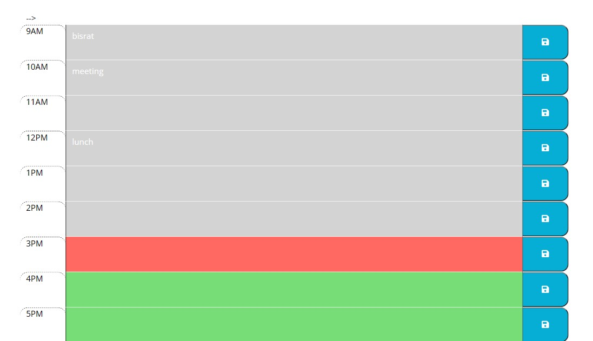
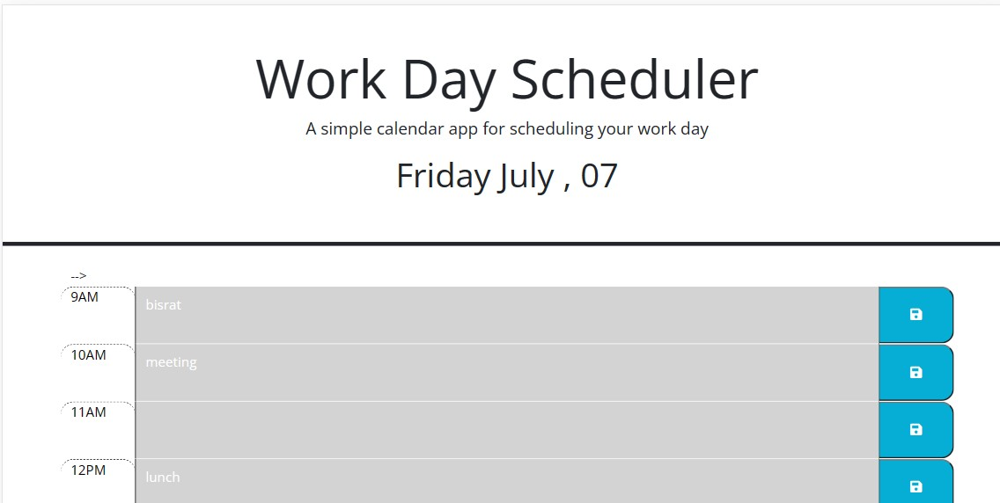
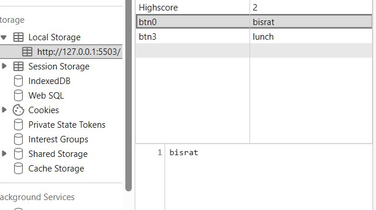

# workdaycalander

/* bisrat Mengesha/

work day schedule assignment

it includes array for loop and this

it also use bootstarap

it has dayjs for getting the currnent date

the value stored in localstoreage

image is link 

it has github link https://github.com/Hellobisrat/workdaycalander
